## UniProt Reference Proteome Local Database

A two-script pipeline for downloading, parsing, and querying versioned **UniProt reference proteomes** into a versioned local MySQL database. Designed for bioinformatics labs
running self-hosted infrastructure (e.g. Synology NAS + MySQL).

---

## Overview

The pipeline consists of two independent tools:

- **`uniprot_sync_v7.py`** — downloads the UniProt reference proteome archive and streams it into a local MySQL database.
- **`get_reference_uniprot_set_lib.py`** — retrieves protein sets from that database with flexible filters and exports them as FASTA files.

The database schema is versioned, meaning multiple UniProt releases can coexist in the same instance without overwriting previous data. Sequence storage uses MD5-based deduplication so identical sequences shared across proteomes or versions are stored only once.

---

## Infrastructure

| Component | Role | Path |
| --- | --- | --- |
| Synology NAS | Stores the `.tar.gz` archive | `/mnt/.../Uniprot/` |
| Server (`/var/`) | Runs MySQL; houses the database | configured via `.env` |
| `.env` file | Holds DB credentials | see setup below |

The sync script reads the archive from the NAS mount and writes parsed data to the MySQL instance on the server. Both scripts connect to MySQL using credentials from a shared `.env` file.

---

## Requirements

- Python 3.8+
- MySQL 8.0+
- BioPython (`biopython`)
- `mysql-connector-python`
- `python-dotenv`
- `requests`

Install dependencies:

```bash
pip install biopython mysql-connector-python python-dotenv requests
```

---

## Configuration

Create a `.env` file in the same directory as both scripts:

```
DB_HOST=192.168.1.100       # MySQL host (IP or hostname)
DB_USER=uniprot_user        # MySQL username
DB_PASSWORD=your_password   # MySQL password
DB_NAME=uniprot_db          # Target database name
```

For read only rights for the team , a new user can be created and then access the database like this:

```
mysql -u cglab_user -p​
```

To create the new user the config block inside get_reference_set.py script can be updated like this:

# Load DB Config with Read-Only Defaults for the Lab
```python
    DB_CONFIG = {
        "host": os.getenv("DB_HOST", "localhost"),
        "user": os.getenv("DB_USER", "new_user"),
        "password": os.getenv("DB_PASSWORD", "lab_password"), # Change to your actual lab password
        "database": os.getenv("DB_NAME", "uniprot_db"),
    }

    retriever = UniProtRetriever(DB_CONFIG)

    try:
        retriever.connect()
```

In SQL, connect as root and proceed:

```sql
CREATE USER 'cglab_user'@'localhost' IDENTIFIED BY 'lab_password';
GRANT SELECT ON uniprot_db_cglab.* TO 'cglab_user'@'localhost';
FLUSH PRIVILEGES;
```

The read-only users can connect in the database like this, by giving the password:

```sql
mysql -u cglab_user -p
```

The sync script also reads two hardcoded paths at the top of the file that should match your NAS mount:

```bash
BASE_PATH = "/mnt/.../Uniprot/"
LOCAL_DATA_FILE = os.path.join(BASE_PATH, "Reference_Proteomes_2026_01.tar.gz")
```

---

## Database Schema

The pipeline creates 8 tables in the correct foreign-key dependency order. All `CREATE TABLE` statements use `IF NOT EXISTS`, so the schema initialisation is idempotent. Sequence deduplication is handled automatically — identical sequences across proteomes share a single row in the `sequences` table, reducing storage significantly.

**Database Schema**

```
sequences         — deduplicated amino-acid sequences (MD5 hash, auto-increment seq_id)
proteomes         — one row per reference proteome (UP-prefixed ID → taxon_id)
proteins          — versioned protein metadata; PRIMARY KEY (accession, version)
sequence_changes  — records when a protein's sequence changes between versions
go_terms          — Gene Ontology master table (go_id, go_name, namespace, definition)
protein_go        — protein ↔ GO term links, version-specific
pfam_domains      — Pfam domain master table (pfam_id, pfam_name, description)
protein_pfam      — protein ↔ Pfam domain links with positional and e-value data
```

Foreign key relationships:

```mermaid
erDiagram
  sequences {
    int seq_id PK
    char md5_hash
    text sequence
  }
  proteomes {
    varchar proteome_id PK
    int taxon_id
    varchar scientific_name
    varchar assembly
  }
  proteins {
    varchar accession PK
    int version PK
    int seq_id FK
    varchar proteome_id FK
    varchar gene_name
    varchar protein_name
    int length
    timestamp updated_at
  }
  sequence_changes {
    int change_id PK
    varchar accession FK
    int old_version
    int new_version
    int old_seq_id FK
    int new_seq_id FK
    timestamp changed_at
  }
  go_terms {
    varchar go_id PK
    varchar go_name
    varchar namespace
    text definition
  }
  protein_go {
    varchar accession FK
    int version FK
    varchar go_id FK
    varchar evidence_code
    varchar source
  }
  pfam_domains {
    varchar pfam_id PK
    varchar pfam_name
    text description
    varchar clan_id
  }
  protein_pfam {
    varchar accession FK
    int version FK
    varchar pfam_id FK
    int seq_start
    int seq_end
    float e_value
    float bit_score
  }

  proteomes ||--o{ proteins : "contains"
  sequences ||--o{ proteins : "seq_id"
  proteins ||--o{ sequence_changes : "accession"
  sequences ||--o{ sequence_changes : "old_seq_id"
  proteins ||--o{ protein_go : "accession+version"
  go_terms ||--o{ protein_go : "go_id"
  proteins ||--o{ protein_pfam : "accession+version"
  pfam_domains ||--o{ protein_pfam : "pfam_id"
```

---

## Architecture

```
UniProt FTP
│
▼
UniProtDownloader          ← streams Reference_Proteomes_XXXX_XX.tar.gz
│
▼
UniprotParser              ← parses .dat.gz flat files (BioPython + line scan)
│                         extracts: proteins, GO terms, Pfam domains
▼
DataBaseManager            ← bulk upserts into 8-table MySQL schema
│                         sequence deduplication via MD5 hash
▼
MySQL Database
│
▼
UniProtRetriever           ← flexible query interface → FASTA export
```

---

## Usage

### 1. Sync a UniProt version

```bash
#Basic sync (downloads if not present, skips if version already in DB)
python uniprot_sync.py -version 2026_01

#Force re-sync even if version already exists
python uniprot_sync.py -version 2026_01 --force

#Tune batch size for your hardware (default: 50,000)
python uniprot_sync.py -version 2026_01 --batch-size 100000
```

If the archive already exists at the configured NAS path, the download step is skipped and parsing begins immediately. If the version already exists in the database, the script exits early unless `--force` is passed.

**Options:**

| Flag | Default | Description |
| --- | --- | --- |
| `-version` | required | UniProt release string, e.g. `2026_01` |
| `--batch-size` | 50000 | Number of records committed per database transaction |
| `--force` | off | Re-sync even if this version already exists in the database |

**Progress output** (printed every 30 seconds during a long run):

```
============================================================
UniProt Reference Proteome Pipeline v8 — 2026_01
Started: 2026-01-28 14:23:01
Batch size: 50,000
============================================================

Streaming from 2026_01 archive...

  [0:05:30] Proteomes: 420 | Proteins: 1,250,000 | Rate: 3,800/sec | Cache: 94,230 | Current: UP000005640
  ...

```

**Final summary on completion Example:**

```
============================================================
Pipeline Completed Successfully
============================================================
  Total proteins:       226,452,210
  Unique proteomes:     34,230
  Unique sequences:     198,340,120
  Sequence dedup ratio: 12.41%
  GO terms linked:      88,234,102
  Pfam domains linked:  71,892,445
  Total duration:       3:42:18
============================================================
```

A log entry is written to `update_history.log` in `BASE_PATH` on both success and failure.

---

### 2. Retrieve a protein set

```bash
python get_reference_uniprot_set_v4.py -version 2026_01 [filters]

# List all available versions in your database
python get_reference_uniprot_set.py -version 2026_01 --list-versions

# List all proteome IDs for a version
python get_reference_uniprot_set.py -version 2026_01 --list-proteomes

# Retrieve by Proteome ID (e.g. Human reference proteome)
python get_reference_uniprot_set.py -version 2026_01 --proteome-id UP000005640

# Retrieve by Taxonomy ID
python get_reference_uniprot_set.py -version 2026_01 -taxonomy 9606

# Retrieve multiple taxa
python get_reference_uniprot_set.py -version 2026_01 -taxonomy 9606 10090 10116

# Filter by GO term
python get_reference_uniprot_set.py -version 2026_01 --go-id GO:0005634

# Filter by Pfam domain
python get_reference_uniprot_set.py -version 2026_01 --pfam-id PF00870

# Combine filters (e.g. human kinases)
python get_reference_uniprot_set.py -version 2026_01 -taxonomy 9606 --pfam-id PF00069
```

**Output:** A FASTA file in the current directory. Filename format: `uniprot_<identifier>_<version>.fasta`

FASTA header format:

```
>P04637 P53_HUMAN OX=9606 UP=UP000005640
```

---

---

## Performance Notes

- The sync script uses bulk MySQL session tuning (`foreign_key_checks = 0`, `unique_checks = 0`) during the load, which provides roughly 2–5x faster insert throughput. These are session-level changes and do not affect other connections.
- Sequence deduplication uses an in-memory MD5 hash cache (up to 100 million entries) to avoid redundant database round-trips. Batch lookups are chunked at 10,000 hashes per query to stay within MySQL packet limits.
- If the NAS CPU is a Celeron or ARM-based processor, running the sync script on a workstation and pointing `DB_HOST` in `.env` at the server IP will substantially improve parsing speed, as gzip decompression and BioPython parsing are CPU-bound.

---

## File Structure

```
.
├── uniprot_sync_v7.py              # Sync pipeline
├── get_reference_uniprot_set_v4.py # Retrieval tool
├── .env                            # DB credentials (not committed)
└── README.md
```

The NAS archive and log file are stored outside this repository:

```
/mnt/cglab.shared/Data/DBs/Uniprot/
├── Reference_Proteomes_2026_01.tar.gz
└── update_history.log
```

---

## Notes on the Archive Layout

The UniProt reference proteome archive is organised as:

```
Archaea/UP000000242/UP000000242_2234.dat.gz
Bacteria/UP000001234/UP000001234_83333.dat.gz
Eukaryota/UP000005640/UP000005640_9606.dat.gz
...
```

The sync script streams only canonical sequence files (`.dat.gz`), skipping `_additional` files (isoforms) and macOS metadata prefixes (`._`).

---
